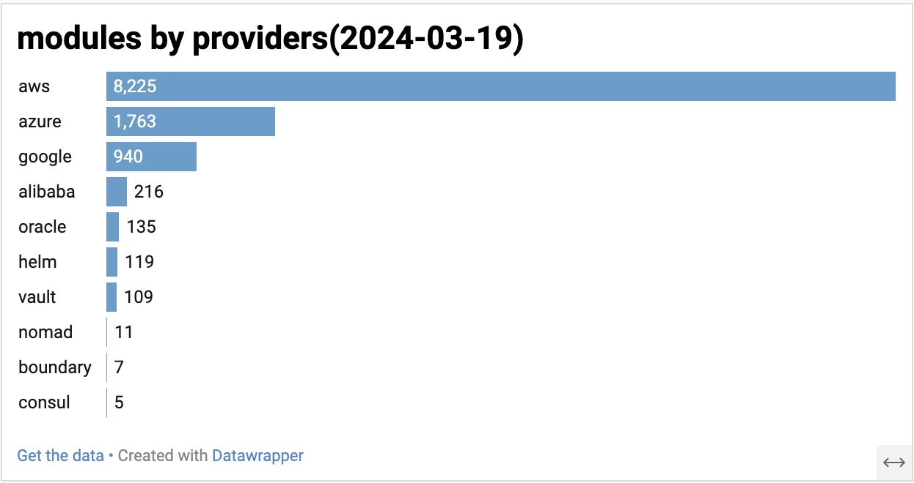
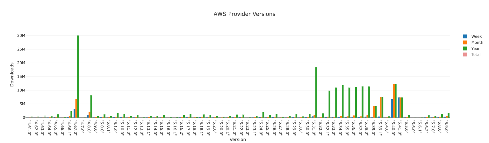

# Terraform Registry Analysis

## counts

- providers: 4009
- modules: 16010
- policy libraries: 18

## providers

### number of modules available for providers


### most popular providers based on downloads

| provider                | downloads       | namespace   |
| ----------------------- | --------------- | ----------- |
| "hashicorp/aws"         | ~2.66 billion    | "hashicorp" |
| "hashicorp/random"      | ~910 million     | "hashicorp" |
| "hashicorp/null"        | ~859 million     | "hashicorp" |
| "hashicorp/template"    | ~753 million     | "hashicorp" |
| "hashicorp/google"      | ~693 million     | "hashicorp" |
| "hashicorp/azurerm"     | ~561 million     | "hashicorp" |
| "hashicorp/kubernetes"  | ~402 million     | "hashicorp" |
| "hashicorp/google-beta" | ~363 million     | "hashicorp" |
| "hashicorp/local"       | ~339 million     | "hashicorp" |
| "hashicorp/external"    | ~314 million     | "hashicorp" |


## modules


- total modules: 16010
- number of modules downloaded more than x times

| x          | count(modules) |
| ---------- | -------------- |
| 20 million | 11             |
| 10 million | 20             |
| 1 million  | 119            |
| 100k       | 487            |
| 10k        | 1536           |
| 1k         | 9762           |
| 100        | 13484          |

### modules with more than 20 million downloads

- terraform-aws-modules/iam/aws
- cloudposse/label/null
- terraform-aws-modules/vpc/aws
- terraform-aws-modules/s3-bucket/aws
- terraform-aws-modules/eks/aws
- terraform-aws-modules/security-group/aws
- terraform-aws-modules/lambda/aws
- terraform-google-modules/project-factory/google
- terraform-aws-modules/kms/aws
- terraform-aws-modules/rds/aws
- terraform-google-modules/kubernetes-engine/google

### provider distribution for modules with more than 1 million downloads for modules. 

```
75 "aws"
27 "google"
4 "azurerm"
3 "null"
2 "yaml"
2 "terraform"
2 "oci"
1 "template"
1 "ec"
1 "cidr"
1 "aviatrix"
```

### some popular community modules


| provider                     | all-downloads | last-week-downloads |
| ---------------------------- | ------------- | ------------------- |
| "gavinbunney/kubectl"        | 66.9 million  | 1.1 million         |
| "cyrilgdn/postgresql"        | 59.6 million  | 1.1 million         |
| "Ferlab-Ste-Justine/netaddr" | 32.6 million  | 11 thousand         |
| "carlpett/sops"              | 19.2 million  | 265 thousand        |
| "vancluever/acme"            | 14.2 million  | 150 thousand        |
| "kreuzwerker/docker"         | 12.9 million  | 167 thousand        |
| "Mongey/kafka"               | 12.1 million  | 228 thousand        |
| "cyrilgdn/rabbitmq"          | 7.8 million   | 169 thousand        |
| "scottwinkler/shell"         | 6.9 million   | 62 thousand         |


### some non-tech companies that have public terraform modules

> gpt generated list based on data from registry, may not be accurate and definitely incomplete

- Walt Disney Company
- Hapag-Lloyd AG (Shipping and Logistics)
- Fred Hutchinson Cancer Research Center
- RevenueCat (Mobile App Monetization)
- GeminiWind (Renewable Energy)
- CrowdStrike (Cybersecurity)
- Snowflake-Labs (Data Analytics)
- Babbel
- AirAsia
- Palantir
- BrunoReboul
- DigitalOcean
- DrFaust92
- Hapag-Lloyd
- 104corp
- MaxKelsen
- JamesBelchamber
- InnovationNorway
- GeminiWind
- FredHutch
- FormidableLabs


## Some random interesting facts
- source repo for all public providers is hosted on github
- hashicorp/template provider was archived 3.5 years ago, yet it still has 3.6 weekly million downloads
- you use jq in terraform with "massdriver-cloud/jq" provider :)
- Disney has 1 public terraform module -> disney/kinesis-firehose-splunk/aws/

## view release download history for aws provider

screenshot of aws provider download history



let me know if you would like to see an interactive chart for provider releases download history.
